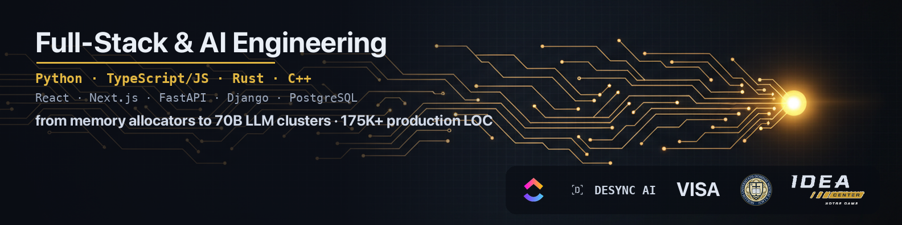

  

<h1 align="center">Hi, I'm Stefan</h1>

  <b>CS @ Notre Dame '27</b> &nbsp;·&nbsp; Software Engineer @ ClickUp (summer 2026) &nbsp;·&nbsp; Founding Engineer @ Desync AI &nbsp;·&nbsp; Founder, Innovation Sprint Lab

  
  
  
  

---

### Projects

| Project | What it is |
|---|---|
| **[coremetrics](https://github.com/sviatil0/coremetrics)** | Cross-platform system monitor (CPU / RAM / GPU / processes) on a from-scratch C++23 GUI toolkit over raw SDL3 pixel surfaces; no Qt, no Electron, no Dear ImGui. 728 commits, 30 releases, 33 test suites, Linux + macOS + Windows CI. 92% of the ~17K-line codebase by `git blame`, computed live by a CI job on every push to `main`. Installs via a [Homebrew tap](https://github.com/sviatil0/homebrew-coremetrics). |
| **[gridfs](https://github.com/sviatil0/gridfs)** | FAT-style filesystem in 100% safe Rust: superblock, inode table, free-block bitmap, direct + single-indirect block pointers, an `fsck`-style consistency checker, and a small CLI. 18 tests, zero `unsafe`. |
| **[mini-allocator](https://github.com/sviatil0/mini-allocator)** | Drop-in `malloc` / `free` / `realloc` in C: 6 segregated free lists, boundary tags with O(1) coalescing, guard-word corruption checks, benchmarked against glibc via `make bench`. |
| **[microshell](https://github.com/sviatil0/microshell)** | POSIX-ish shell in C11: pipelines, redirects, job control (`jobs` / `fg` / `bg` / `kill`), 12 builtins, variable expansion, CI. |
| **[nd-canvas-study](https://github.com/sviatil0/nd-canvas-study)** | AI exam-prep pipeline: scrapes Canvas course materials with Playwright, indexes them into a Chroma vector DB, surfaces under-prepared exam topics, and serves a local Django UI. |
| **[email-relationship-analyzer](https://github.com/sviatil0/email-relationship-analyzer)** | Gmail relationship intelligence: OAuth2 ingest of sent threads, Gemini analysis (participants, context, sentiment), structured results stored in MongoDB. |
| **[claude-code-haptic](https://github.com/sviatil0/claude-code-haptic)** | Trackpad haptic feedback for Claude Code on macOS; shipped as a VS Code Marketplace extension. |
| **[crossword-generator](https://github.com/sviatil0/crossword-generator)** | Crossword-puzzle generator in C: multi-pass letter-matching placement with anagram clues and failure diagnostics; demo output in the README. |
| **[nd-fundcomp](https://github.com/sviatil0/nd-fundcomp)** | First-semester C coursework worth keeping: Snake (X11), Conway's Game of Life, recursive fractals, animations. |

  
  

---

### Currently

- **ClickUp** (summer 2026): software engineer on the Chat team.
- **Desync AI**: founding engineer.
- **Innovation Sprint Lab** (Notre Dame): founder and program director. 15 engineers selected from 70+ applicants, $10K+ raised; mentors include ClickUp's CTO and Teamworthy Ventures.

Previously co-founded **Tweeds**, an early-stage AI startup, where I built the production async Python pipeline (2024 to 2026).

---

### Tech stack

### Contact

- **Email:** [soleksiienko1@gmail.com](mailto:soleksiienko1@gmail.com)
- **LinkedIn:** [linkedin.com/in/soleksii](https://www.linkedin.com/in/soleksii/)
- **Book a time:** [calendar.app.google/umM5GH6EJSnFatv27](https://calendar.app.google/umM5GH6EJSnFatv27)

  <i>Always happy to talk systems, C++, or product engineering.</i>

